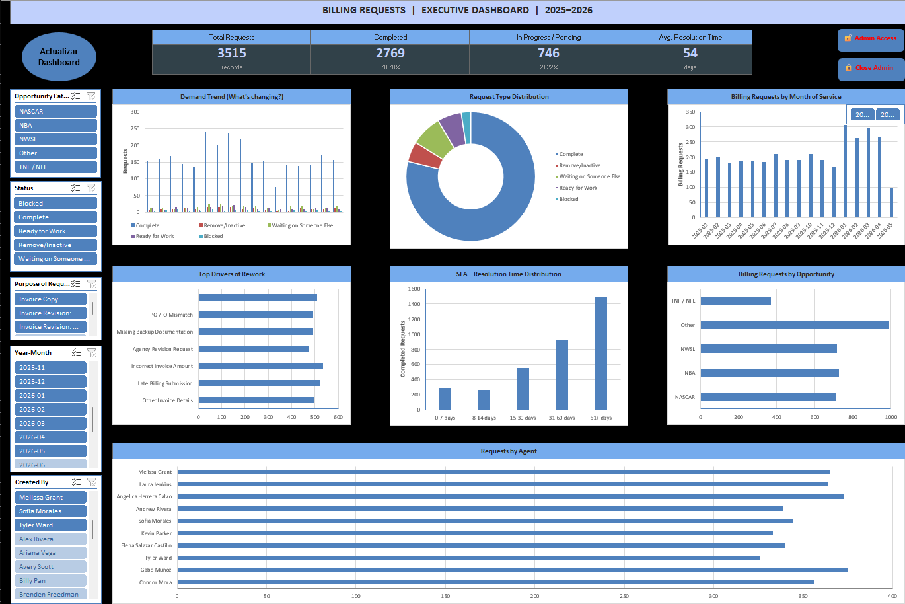
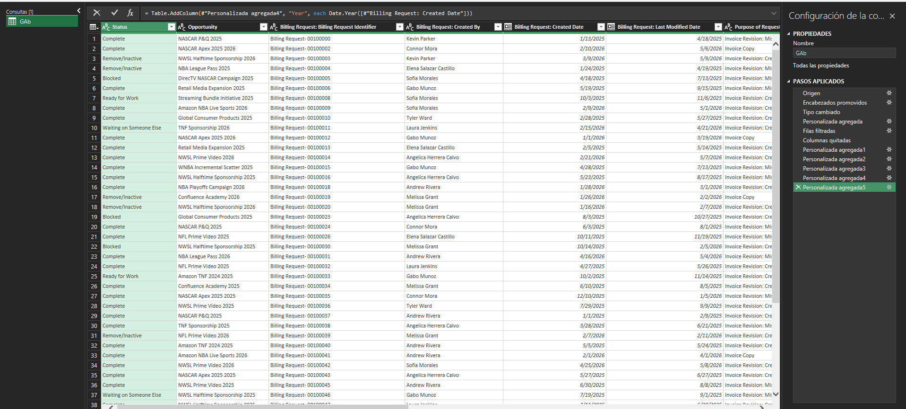
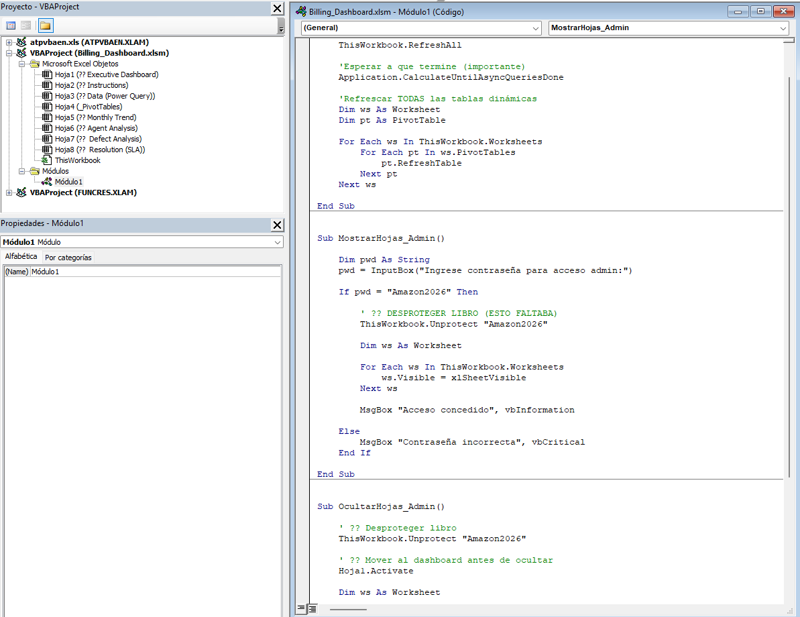

# Executive Billing Operations Dashboard

Automated Executive Dashboard for Billing Operations using Excel VBA, Power Query, PivotTables, PivotCharts, and KPI-driven analytics.

---

# Dashboard Overview



---

# Project Objective

This project simulates a production-style billing operations environment where users monitor:

- Billing request volume
- SLA compliance
- Resolution time trends
- Rework drivers
- Operational bottlenecks
- Agent performance
- Opportunity segmentation

The solution was designed to mimic a real enterprise reporting workflow using Excel-based Business Intelligence and automation tools.

---

# Key Features

## Automated Data Refresh
- One-click dashboard refresh
- Automated PivotTable updates
- Automated PivotChart refresh
- Dynamic KPI recalculation

## Power Query Data Engineering
- CSV ingestion automation
- Data transformation pipeline
- Derived metric creation
- SLA bucket calculations
- Opportunity categorization
- Dynamic Year-Month logic

## Interactive Dashboard
- Dynamic slicers
- Executive KPI cards
- Trend analysis
- Resolution distribution analysis
- Opportunity segmentation
- Agent performance tracking

## VBA Automation
- Dashboard refresh orchestration
- Pivot refresh automation
- Admin access controls
- Hidden sheet management
- Workbook protection handling

---

# Power Query Transformations



The dashboard uses Power Query to automate:
- data ingestion
- transformation logic
- SLA calculations
- categorization logic
- dynamic reporting structure

---

# VBA Automation



The solution includes VBA-based automation for:
- full dashboard refresh
- admin controls
- workbook protection
- sheet visibility management
- pivot synchronization

---

# Technologies Used

- Microsoft Excel
- VBA
- Power Query
- PivotTables
- PivotCharts
- Slicers
- Business Intelligence Reporting
- Data Transformation
- KPI Analytics

---

# Architecture Flow

```text
CSV Source File
        ↓
Power Query Transformations
        ↓
Data Model / Tables
        ↓
PivotTables
        ↓
PivotCharts + KPIs
        ↓
Executive Dashboard
        ↓
VBA Refresh Automation
```

---

# Business Value

This dashboard was designed to reduce manual reporting effort by automating:
- data refresh processes
- KPI calculations
- SLA monitoring
- operational reporting workflows

The project demonstrates practical Business Intelligence, reporting automation, and operational analytics skills within an Excel enterprise environment.

---

# Notes

This repository contains a portfolio/demo version using fictional data for demonstration purposes.
